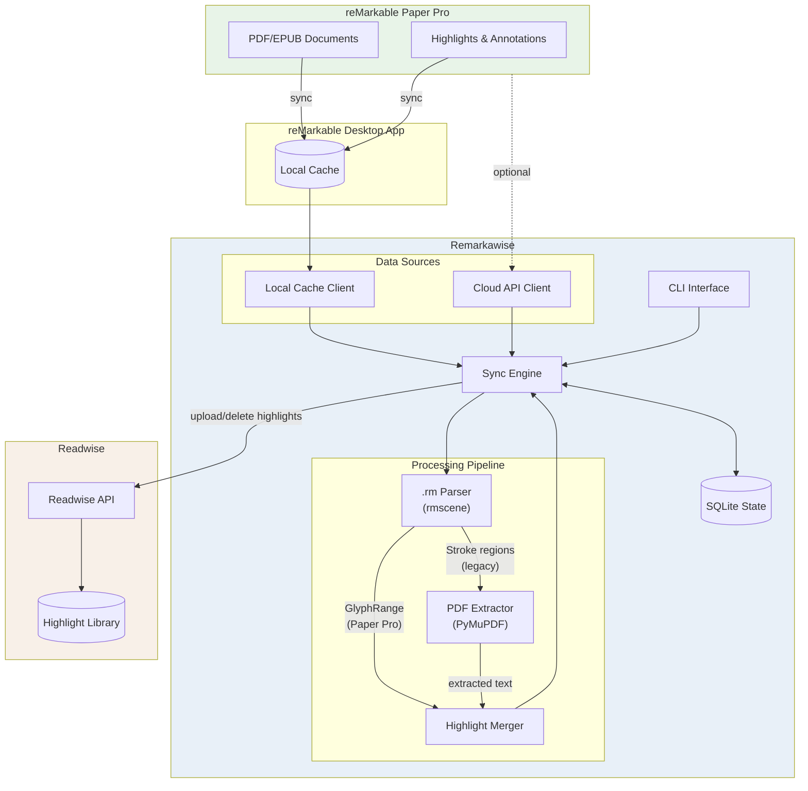
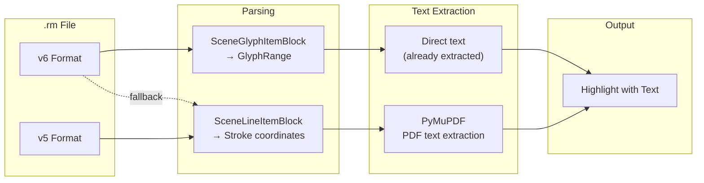

# Remarkawise

Sync highlights from your reMarkable Paper Pro to Readwise Reader.

## Features

- **Local-first**: Reads directly from the reMarkable desktop app cache (no cloud API dependency)
- **PDF & EPUB support**: Syncs highlights from both PDFs and EPUBs (including web articles saved via browser extension)
- **Automatic highlight extraction**: Extracts highlights from reMarkable's annotation files (`.rm` format)
- **PDF text extraction**: Maps highlight regions to actual text content using PyMuPDF
- **Native PDF highlights**: Also syncs highlights embedded directly in PDFs
- **Incremental sync**: Only syncs new highlights (existing highlights are not re-uploaded)
- **Deletion sync**: Removes highlights from Readwise when deleted on reMarkable
- **State tracking**: Remembers what has been synced to avoid duplicates

## Installation

```bash
# Clone the repository
git clone https://github.com/pmary/Remarkawise.git
cd Remarkawise

# Install with pip
pip install -e .

# Or with development dependencies
pip install -e ".[dev]"
```

## Configuration

### 1. Choose your data source

Remarkawise supports two ways to access your reMarkable documents:

| Source | Description | Requirements |
|--------|-------------|--------------|
| `local` (default) | Reads from reMarkable desktop app cache | Desktop app installed and synced |
| `cloud` | Uses reMarkable Cloud API | Device token (see below) |

**Recommended:** Use `local` mode. It's faster, works offline, and doesn't depend on the unofficial cloud API.

### 2. Set up Readwise access

1. Get your Readwise access token from https://readwise.io/access_token
2. Create your `.env` file:

```bash
cp .env.example .env
# Edit .env and add your Readwise token
```

Your `.env` file should look like:

```
REMARKABLE_SOURCE=local
READWISE_ACCESS_TOKEN=your_readwise_token_here
```

### 3. Verify configuration

```bash
remarkawise auth readwise
```

### (Optional) Cloud API access

If you prefer to use the cloud API instead of the local cache:

```bash
remarkawise auth remarkable
```

This will guide you through the device registration process:
1. Visit https://my.remarkable.com/device/desktop/connect
2. Enter the one-time code shown on the website
3. Save the device token to your `.env` file
4. Set `REMARKABLE_SOURCE=cloud` in your `.env`

**Note:** The cloud API is unofficial and may break if reMarkable changes their backend.

## Usage

### Sync highlights

```bash
# Sync all new highlights (uses local cache by default)
remarkawise sync

# Force re-sync everything
remarkawise sync --force

# Sync a specific document
remarkawise sync --document <document-id>

# Use cloud API instead of local cache
remarkawise sync --source=cloud
```

### View status

```bash
remarkawise status
```

### List documents

```bash
# List syncable documents - PDFs and EPUBs (uses local cache by default)
remarkawise list-documents

# Show full document IDs (useful for --document flag)
remarkawise list-documents --full-id

# Show all document types (including notebooks)
remarkawise list-documents --all

# Use cloud API instead of local cache
remarkawise list-documents --source=cloud
```

### Reset sync state

If you need to re-sync highlights (e.g., after manually deleting from Readwise), you can reset the sync state:

```bash
# Reset a specific document
remarkawise reset --document <document-id>

# Reset all documents (will prompt for confirmation)
remarkawise reset --all

# Reset without confirmation (for scripts)
remarkawise reset --all --yes
```

**Note:** This clears the local tracking database, not Readwise. After reset, the next sync will re-upload all highlights as new entries.

## How it works

1. **Fetch documents**: Reads from local desktop app cache (or cloud API if configured)
2. **Parse highlights**: Reads `.rm` files to find highlighter strokes and their coordinates
3. **Extract text**: Uses PyMuPDF to extract the actual text content from highlight regions
4. **Detect changes**: Compares current highlights against previously synced state
5. **Sync to Readwise**: Uploads new highlights and deletes removed ones from Readwise
6. **Track state**: Stores sync state locally (SQLite) to enable incremental updates

## Architecture

### Data Flow



### Highlight Extraction

The tool supports two highlight formats:

1. **Paper Pro Format (GlyphRange)**: On reMarkable Paper Pro, highlights on PDFs/EPUBs include pre-extracted text stored as `GlyphRange` objects. The text is already available, no PDF parsing needed.

2. **Legacy Format (Strokes)**: Older reMarkable devices store highlights as highlighter strokes with coordinates. The tool extracts text by mapping stroke bounding boxes to PDF text regions using PyMuPDF.



### Project Structure

```
src/remarkawise/
├── cli.py              # Command-line interface (Typer)
├── config.py           # Configuration management (Pydantic Settings)
├── models.py           # Data models (Pydantic)
├── remarkable/
│   ├── client.py       # reMarkable Cloud API client
│   ├── local_cache.py  # Local desktop app cache reader
│   └── parser.py       # .rm file parser (rmscene for v6)
├── readwise/
│   └── client.py       # Readwise API client (httpx)
├── pdf/
│   └── extractor.py    # PDF text extraction (PyMuPDF)
└── sync/
    ├── engine.py       # Sync orchestration
    └── state.py        # State persistence (SQLite)
```

## Limitations

- Supports PDF and EPUB documents (notebooks are not supported)
- Requires the reMarkable desktop app to be installed and synced (for local mode)
- Handwritten annotations are not converted to text (only highlighter marks)

## Development

```bash
# Install dev dependencies
pip install -e ".[dev]"

# Run linting
ruff check src/

# Run type checking
mypy src/

# Run tests
pytest
```

## License

MIT License - see LICENSE file for details.

## Credits

- [reMarkable](https://remarkable.com/) for the Paper Pro device
- [Readwise](https://readwise.io/) for the highlight management platform
- [PyMuPDF](https://pymupdf.readthedocs.io/) for PDF processing
