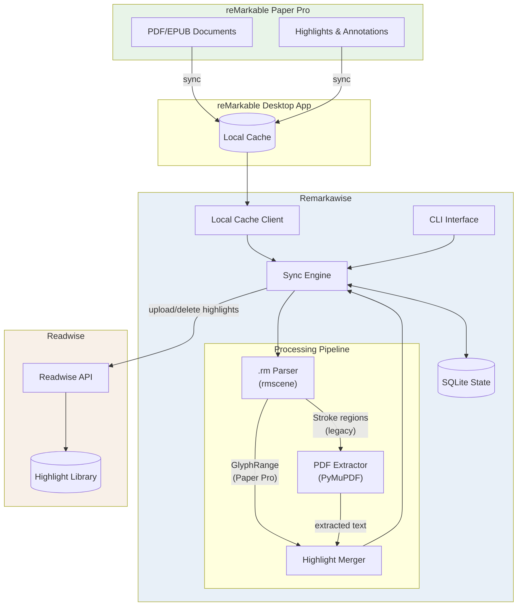
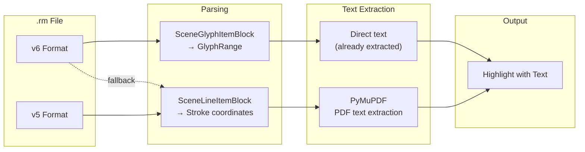

# Remarkawise

Sync highlights from your reMarkable Paper Pro to Readwise Reader.

## Quick Start

```bash
# 1. Install
git clone https://github.com/pmary/Remarkawise.git
cd Remarkawise
pip install -e . # Or if you want to use Anthropic: pip install -e ".[llm]"

# OR if you want to use a virtual environment
# Create a virtual environment
python3 -m venv .venv
# Activate it
source .venv/bin/activate
# Now install works
pip install -e . # Or if you want to use Anthropic: pip install -e ".[llm]"

# 2. Configure (get token from https://readwise.io/access_token)
cp .env.example .env
# Edit .env and add: READWISE_ACCESS_TOKEN=your_token

# 3. Verify setup
remarkawise auth

# 4. Sync your highlights
remarkawise sync
```

## Requirements

- **Python 3.10+**
- **reMarkable desktop app** installed and synced
  - macOS: Download from [remarkable.com](https://remarkable.com/desktop)
  - Windows/Linux: Also supported (see [Configuration](#configuration) for cache paths)
- **Readwise account** with API access ([get token here](https://readwise.io/access_token))

## Features

### Core
- **Local-first**: Reads directly from the reMarkable desktop app cache (no cloud API needed)
- **PDF & EPUB support**: Syncs highlights from PDFs and EPUBs (including web articles)
- **Incremental sync**: Only syncs new highlights, tracks what's been synced
- **Deletion sync**: Removes highlights from Readwise when deleted on reMarkable

### Advanced
- **Tag filtering**: Sync only documents with a specific tag (e.g., `--tag readwise`)
- **Content categories**: Control Readwise placement (Books vs Articles tab) via document tags
- **LLM text cleanup**: Optional Claude AI integration to fix garbled PDF text

## Installation

```bash
# Clone the repository
git clone https://github.com/pmary/Remarkawise.git
cd Remarkawise

# Install with pip
pip install -e .

# Or with development dependencies
pip install -e ".[dev]"
```

## Configuration

### 1. Set up Readwise access

1. Get your Readwise access token from https://readwise.io/access_token
2. Create your `.env` file:

```bash
cp .env.example .env
# Edit .env and add your Readwise token
```

Your `.env` file should look like:

```
READWISE_ACCESS_TOKEN=your_readwise_token_here
```

### 2. (Optional) Configure cache path

On **macOS**, the cache path is auto-detected. On **Windows** or **Linux**, or if your cache is in a custom location, add to `.env`:

```bash
# Windows (typical path)
REMARKABLE_LOCAL_CACHE_PATH=C:\Users\YourName\AppData\Local\remarkable\remarkable\desktop

# Linux (typical path)
REMARKABLE_LOCAL_CACHE_PATH=/home/yourname/.local/share/remarkable/desktop

# macOS (auto-detected, but can override)
REMARKABLE_LOCAL_CACHE_PATH=/Users/yourname/Library/Containers/com.remarkable.desktop/Data/Library/Application Support/remarkable/desktop
```

### 3. Verify configuration

```bash
remarkawise auth
```

## Usage

### Sync highlights

```bash
# Sync all new highlights
remarkawise sync

# Force re-sync everything
remarkawise sync --force

# Sync a specific document
remarkawise sync --document <document-id>

# Sync only documents with a specific tag
remarkawise sync --tag readwise

# Use LLM to fix corrupted text (requires ANTHROPIC_API_KEY)
remarkawise sync --llm-cleanup
```

#### Filtering by tag

You can tag documents on your reMarkable and only sync documents with a specific tag:

1. On your reMarkable, open a document
2. Tap the menu (three dots) and select "Add tag"
3. Create a tag called "readwise" (or any name you prefer)
4. Use `remarkawise sync --tag readwise` to only sync tagged documents

This is useful if you only want certain documents to sync to Readwise.

#### Setting the author manually

When a document has no embedded author metadata (or you want to override it), you can set the author directly on your reMarkable using a tag:

1. On your reMarkable, open a document
2. Tap the menu (three dots) and select "Add tag"
3. Create a tag like `author:Cal Newport`
4. The author name will be picked up on the next sync

Multiple `author:` tags are joined with a comma (e.g., `author:Alice Smith` + `author:Bob Jones` → "Alice Smith, Bob Jones"). The prefix is case-insensitive (`author:`, `Author:`, `AUTHOR:` all work).

**Author resolution priority:**
1. `author:` tag on reMarkable (manual override)
2. Author from document metadata (`.content` file)
3. Author embedded in PDF metadata
4. "Unknown" (Readwise fallback)

#### Setting content category

Control where synced highlights appear in Readwise (Books or Articles tab):

- Tag a document with `article` → highlights appear in **Articles** tab
- Tag a document with `book` → highlights appear in **Books** tab
- No category tag → defaults to **Books** tab

Tag matching is case-insensitive. You can combine category tags with filter tags (e.g., tag a document with both `readwise` and `article`).

#### LLM text cleanup (optional)

PDF text extraction can sometimes produce corrupted text (missing spaces, broken ligatures, etc.). The `--llm-cleanup` flag uses Claude AI to fix these issues.

1. Get an API key from https://console.anthropic.com
2. Add to your `.env` file:
   ```
   ANTHROPIC_API_KEY=sk-ant-...
   ```
3. Install the optional dependency:
   ```bash
   pip install -e ".[llm]"
   ```
4. Use the flag when syncing:
   ```bash
   remarkawise sync --llm-cleanup
   ```

This uses Claude Haiku (~$0.25/million tokens), so typical syncs cost fractions of a cent.

### View status

```bash
remarkawise status
```

### List documents

```bash
# List syncable documents - PDFs and EPUBs
remarkawise list-documents

# Show full document IDs (useful for --document flag)
remarkawise list-documents --full-id

# Show all document types (including notebooks)
remarkawise list-documents --all
```

### Reset sync state

If you need to re-sync highlights (e.g., after manually deleting from Readwise), you can reset the sync state:

```bash
# Reset a specific document
remarkawise reset --document <document-id>

# Reset all documents (will prompt for confirmation)
remarkawise reset --all

# Reset without confirmation (for scripts)
remarkawise reset --all --yes
```

**Note:** This clears the local tracking database, not Readwise. After reset, the next sync will re-upload all highlights as new entries.

## Troubleshooting

### "reMarkable desktop cache not found"

The tool can't find your reMarkable desktop app cache. Solutions:

1. **Make sure the desktop app is installed** and has synced at least once
2. **Check the cache path** - on Windows/Linux, you need to set `REMARKABLE_LOCAL_CACHE_PATH` in your `.env` file (see [Configuration](#configuration))
3. **Verify the path exists** - navigate to it in your file explorer

### "No documents found"

1. Make sure documents are **synced** in the reMarkable desktop app
2. If using `--tag`, verify your documents have that tag on reMarkable
3. Run `remarkawise list-documents --all` to see all document types

### Highlight text is garbled or has missing spaces

PDF text extraction isn't perfect. Try:

1. Use `--llm-cleanup` flag to fix text with AI (requires `ANTHROPIC_API_KEY`)
2. Check if the PDF has selectable text (scanned PDFs won't work well)

### Highlights not appearing in Readwise

1. Run `remarkawise auth` to verify your token is valid
2. Check `remarkawise status` to see if highlights were synced
3. Use `remarkawise sync --verbose` to see detailed output

## How it works

1. **Fetch documents**: Reads from the reMarkable desktop app local cache
2. **Parse highlights**: Reads `.rm` files to find highlighter strokes and their coordinates
3. **Extract text**: Uses PyMuPDF to extract the actual text content from highlight regions
4. **Detect changes**: Compares current highlights against previously synced state
5. **Sync to Readwise**: Uploads new highlights and deletes removed ones from Readwise
6. **Track state**: Stores sync state locally (SQLite) to enable incremental updates

## Architecture

> **Note:** This section is for developers interested in how the tool works internally.

### Data Flow



### Highlight Extraction

The tool supports two highlight formats:

1. **Paper Pro Format (GlyphRange)**: On reMarkable Paper Pro, highlights on PDFs/EPUBs include pre-extracted text stored as `GlyphRange` objects. The text is already available, no PDF parsing needed.

2. **Legacy Format (Strokes)**: Older reMarkable devices store highlights as highlighter strokes with coordinates. The tool extracts text by mapping stroke bounding boxes to PDF text regions using PyMuPDF.



### Project Structure

```
src/remarkawise/
├── cli.py              # Command-line interface (Typer)
├── config.py           # Configuration management (Pydantic Settings)
├── models.py           # Data models (Pydantic)
├── remarkable/
│   ├── local_cache.py  # Local desktop app cache reader
│   └── parser.py       # .rm file parser (rmscene for v6)
├── readwise/
│   └── client.py       # Readwise API client (httpx)
├── pdf/
│   └── extractor.py    # PDF text extraction (PyMuPDF)
├── llm/
│   └── cleanup.py      # LLM-based text cleanup (Anthropic Claude)
└── sync/
    ├── engine.py       # Sync orchestration
    └── state.py        # State persistence (SQLite)
```

## Limitations

- Supports PDF and EPUB documents (notebooks are not supported)
- Requires the reMarkable desktop app to be installed and synced
- Handwritten annotations are not converted to text (only highlighter marks)

## Development

```bash
# Create a virtual environment
python -m venv venv

# Activate it
source venv/bin/activate

# Install it
pip install -e .
# OR with dev dependencies
pip install -e ".[dev]"

# Run linting
ruff check src/

# Run type checking
mypy src/

# Run tests
pytest
```

## License

MIT License - see LICENSE file for details.

## Credits

- [reMarkable](https://remarkable.com/) for the Paper Pro device
- [Readwise](https://readwise.io/) for the highlight management platform
- [PyMuPDF](https://pymupdf.readthedocs.io/) for PDF processing
- [Anthropic](https://anthropic.com/) for Claude AI (optional LLM text cleanup)
